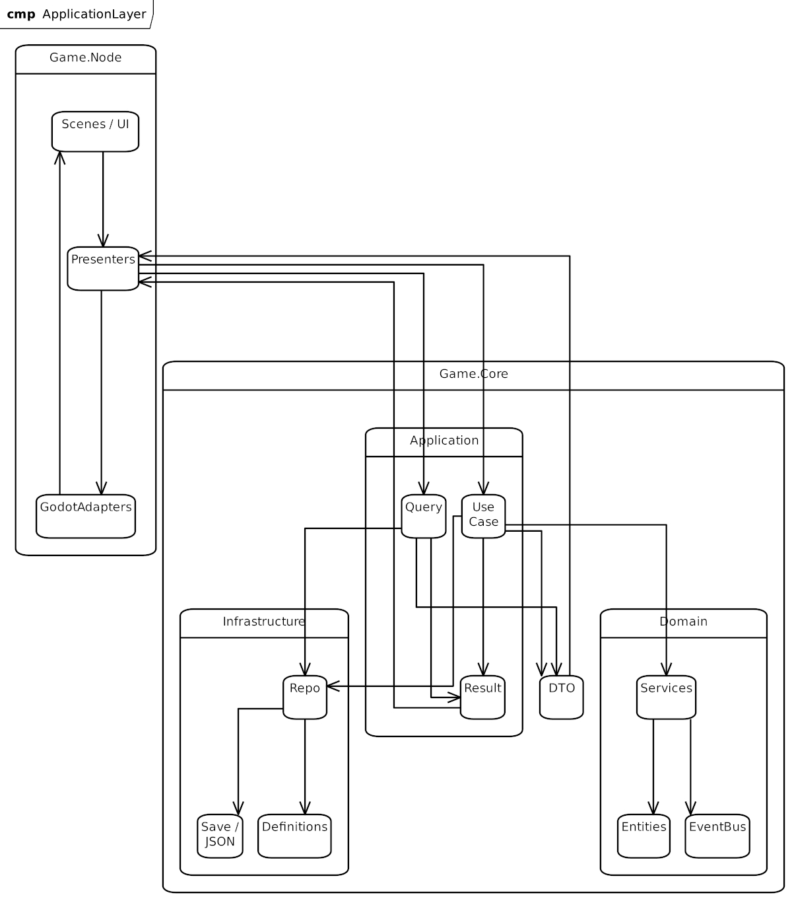

## Cel dokumentu

Dokument definiuje warstwę Application, czyli przypadki użycia, przepływ danych, kontrakty zwracane do warstwy prezentacji oraz odpowiedzialność za koordynację logiki domenowej.

Warstwa Application stanowi pomost pomiędzy:

- UI i Presenterami w `Game.Node`,
- logiką domenową w `Game.Core.Domain`,
- zapisem i odczytem w `Game.Core.Infrastructure`,
- eventami domenowymi i aplikacyjnymi.

# Założenia

1. Jeden use case odpowiada za jedną akcję.
2. Use case zwraca `Result<T>`.
3. Błędy nie są eventami/
4. Queries są osobnym typem od Commandów.
5. Presenter nie zawiera reguł gry.
6. Zmiana scen nie odbywa się przez osobny SceneController.
7. `Game.Node` korzysta z Presenterów, a Presenter zwraca intencję nawigacyjną lub dane widoku.
8. Zapis realizuje Application.
9. EventBus jest globalny, synchroniczny i pub/sub.
10. Wszystkie elementy niezależne od Godota trafiają do `Game.Core`.

# Zakres Application

Warstwa Application odpowiada za:

- uruchamianie przypadków użycia,
- koordynację domeny,
- wywoływanie generatorów i kalkulatorów,
- publikowanie eventów,
- zapis i odczyt,
- przygotowanie danych dla Presenterów,
- przekazywanie intencji nawigacyjnych do warstwy Node.

# Komunikacja

```text
Game.Node
- Presenter
- UseCase
- Domain
- EventBus
- Subscribers
- UseCase Result
- Presenter
- Game.Node
```

Presenter jest odpowiedzialny za:

- uruchomienie use case,
- odebranie wyniku,
- mapowanie `DTO` na model widoku,
- przekazanie intencji nawigacyjnej do warstwy Node.

# Use Cases

## Zasada ogólna

Każda akcja użytkownika powinna mieć osobny use case.

Przykłady:

- `StartNewGameUseCase`
- `ContinueGameUseCase`
- `LoadGameUseCase`
- `SaveGameUseCase`
- `EnterDungeonUseCase`
- `StartCombatUseCase`
- `ResolveTurnUseCase`
- `UseItemUseCase`
- `EquipItemUseCase`
- `BuyItemUseCase`
- `SellItemUseCase`
- `EndCombatUseCase`
- `DistributeRewardsUseCase`
- `ApplyDeathPenaltyUseCase`

## StartNewGameUseCase

Odpowiedzialność:

- utworzenie nowej postaci,
- przygotowanie stanu początkowego,
- przejście do SafeHouseu

Wejście:

- wybrana klasa,
- nazwa postaci.

Wyjście:

- `Result<GameStartDto>`

## ContinueGameUseCase

Odpowiedzialność:

- odczyt ostatnio zapisanego slotu,
- odtworzenie stanu,
- przejście do SafeHouse.

Wejście:

- brak lub identyfikator aktywnego profilu.

Wyjście:

- `Result<GameStateDto>`

## LoadGameUseCase

Odpowiedzialność:

- odczyt wskazanego slotu.

Wejście:

- `saveSlotId`

Wyjście:

- `Result<GameStateDto>`

## SaveGameUseCase

Odpowiedzialność:

- zapis aktualnego stanu gry do aktywnego slotu.

Wejście:

- bieżący stan runtime.

Wyjście:

- `Result<SaveSummaryDto>`

Uwagi:

- zapis może być wywołany ręcznie w SafeHouse,
- zapis może być wywołany automatycznie po śmierci po zastosowaniu kary.

## EnterDungeonUseCase

Odpowiedzialność:

- wygenerowanie nowego dungeonu,
- zainicjalizowanie przeciwników,
- ustawienie postępu eksploracji.

Wejście:

- aktualny poziom,
- stan postaci.

Wyjście:

- `Result<DungeonDto>`

## StartCombatUseCase

Odpowiedzialność:

- utworzenie tymczasowego CombatSession,
- pobranie przeciwnika lub przeciwników,
- przygotowanie starcia.

Wejście:

- stan dungeonu,
- identyfikatory przeciwników.

Wyjście:

- `Result<CombatSessionDto>`

## ResolveTurnUseCase

Odpowiedzialność:

- wykonanie jednej tury walki,
- policzenie obrażeń,
- zastosowanie statusów,
- obsługa śmierci uczestnika,
- publikacja eventów.

Wejście:

- akcja gracza lub enemy.

Wyjście:

- `Result<CombatTurnResultDto>`

## UseItemUseCase

Odpowiedzialność:

- użycie przedmiotu,
- walidacja czy item jest używalny,
- modyfikacja stanu postaci.

Wejście:

- `itemInstanceId`

Wyjście:

- `Result<ItemUseResultDto>`

## EquipItemUseCase

Odpowiedzialność:

- założenie lub zdjęcie przedmiotu,
- aktualizacja wyposażenia.

Wejście:

- `itemInstanceId`,
- `equipmentSlot`.

Wyjście:

- `Result<EquipmentChangeDto>`

## BuyItemUseCase

Odpowiedzialność:

- zakup przedmiotu ze sklepu,
- odjęcie golda,
- dodanie instancji przedmiotu do inventory.

Wejście:

- `shopOfferId`.

Wyjście:

- `Result<TradeResultDto>`

## SellItemUseCase

Odpowiedzialność:

- sprzedaż przedmiotu,
- dodanie golda,
- usunięcie przedmiotu z inventory.

Wejście:

- `itemInstanceId`.

Wyjście:

- `Result<TradeResultDto>`

## ApplyDeathPenaltyUseCase

Odpowiedzialność:

- obliczenie kary po śmierci,
- zachowanie części golda,
- losowe zachowanie części przedmiotów,
- przygotowanie stanu do zapisu.

Wejście:

- stan postaci,
- stan inventory,
- stan dungeonu.

Wyjście:

- `Result<DeathPenaltyDto>`

## EndCombatUseCase

Odpowiedzialność:

- zakończenie walki,
- rozliczenie nagród,
- publikacja wyników.

Wejście:

- `CombatSession`.

Wyjście:

- `Result<CombatEndDto>`

# Queries

Queries odczytują dane bez zmiany stanu.

Wszystkie queries zwracają świeży stan, bez cache.

Przykłady:

- `GetPlayerQuery`
- `GetInventoryQuery`
- `GetDungeonQuery`
- `GetCombatStateQuery`
- `GetSaveSlotsQuery`
- `GetShopOfferQuery`

## GetPlayerQuery

Odpowiedzialność:

- zwrot aktualnego stanu gracza.

Wyjście:

- `Result<PlayerDto>`

## GetInventoryQuery

Odpowiedzialność:

- zwrot bieżącego inventory i equipment.

Wyjście:

- `Result<InventoryDto>`

## GetDungeonQuery

Odpowiedzialność:

- zwrot stanu aktualnego dungeonu.

Wyjście:

- `Result<DungeonDto>`

# DTO

Application zwraca `DTO`, nie encje domenowe.

Przykłady:

- `PlayerDto`
- `InventoryDto`
- `DungeonDto`
- `CombatSessionDto`
- `CombatTurnResultDto`
- `SaveSummaryDto`
- `TradeResultDto`
- `GameStartDto`

DTO służą do:

- przekazania danych do Presenterów,
- mapowania na UI,
- utrzymania separacji warstw.

# Result

Każdy use case i query zwraca `Result<T>`.

Przykład modelu:

- `Success`
- `Failure`
- `ValidationError`
- `NotFound`
- `Conflict`
- `InsufficientFunds`
- `InvalidState`

Błędy są zwracane jako wynik, nie jako event.

# EventBus

EventBus działa w `Game.Core`.

Zasady:

- synchroniczny,
- pub/sub,
- wielu odbiorców,
- bez UI eventów,
- bez osobnego event busa dla UI.

## Przykładowe eventy

- `CombatStarted`
- `TurnStarted`
- `EnemyKilled`
- `PlayerDied`
- `RewardGranted
- `ItemAdded`
- `ItemEquipped`
- `SaveCompleted`
- `DungeonCompleted`

# Presenter

Presenter jest elementem `Game.Node`.

Odpowiedzialność:

- odebranie danych z UI,
- wywołanie odpowiedniego use case,
- mapowanie DTO na model widoku,
- przekazanie intencji nawigacyjnej,
- odświeżenie widoku.

Presenter:

- może trzymać stan widokowy,
- nie przechowuje reguł gry,
- nie wykonuje obliczeń domenowych.

Przykłady:

- `MainMenuPresenter`
- `CombatPresenter`
- `InventoryPresenter`
- `ShopPresenter`
- `CharacterPresenter`

# Nawigacja

Nie używamy osobnego `SceneController`.

Zamiast tego:

1. Presenter wywołuje use case.
2. Use case zwraca DTO oraz opcjonalną intencję nawigacyjną.
3. Warstwa Node interpretuje wynik i zmienia scenę.

Przykład intencji:

- `OpenSafeHouse`
- `OpenDungeon`
- `OpenCombat`
- `OpenReward`
- `OpenDeath`
- `OpenVictory`

# Dependency Injection

W projekcie stosowany jest `Microsoft DI` w kompozycji startowej warstwy Node.

Kompozycja obejmuje:

- rejestrację use case’ów,
- rejestrację serwisów,
- rejestrację repozytoriów,
- wstrzykiwanie zależności do Presenterów.

Jeżeli integracja z Godot wymaga uproszczenia, kompozycja pozostaje w jednym miejscu bootstrapu.

# Infrastructure

Warstwa Infrastructure odpowiada za:

- zapis,
- odczyt,
- serializację JSON,
- repozytoria,
- pliki save,
- definicje danych gry.

Application korzysta z Infrastructure przez interfejsy.

# Relacje



> Rys. Diagram relacji modelu aplikacji

# Ograniczenia

Niedozwolone:

- Presenter nie implementuje reguł gry,
- UseCase nie zna Godot,
- Domain nie zna UI,
- Application nie zależy od scen,
- Scene nie wywołuje logiki domenowej bezpośrednio.
