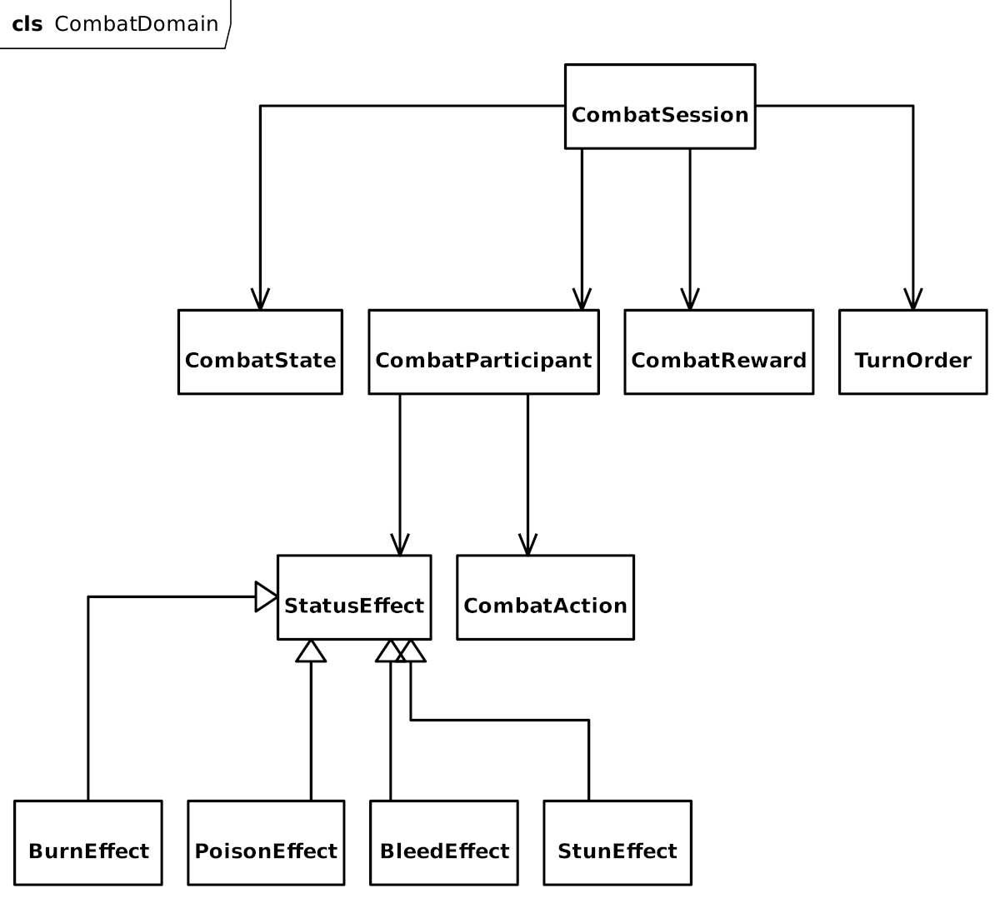

## CombatSession

Agregat odpowiedzialny za przebieg walki.

Zawiera:

- uczestników,
- kolejność tur,
- aktualny stan,
- wynik.

Nie zna UI.

## CombatParticipant

Abstrakcja jednostki.

Implementacje:

- PlayerCombatant
- EnemyCombatant

## CombatAction

Akcja wykonywana w turze.

Typy:

- Attack
- Skill
- Item
- Defend
- Escape

## StatusEffect

Efekt wykonywany po turze.

Implementacje:

- Burn
- Poison
- Bleed
- Stun

Strategia: Strategy Pattern

## CombatReward

Wynik walki.

Zawiera:

- exp
- gold
- items
