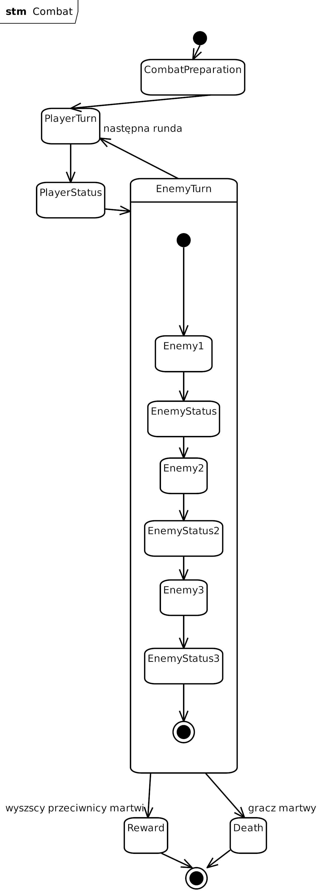

## Cel dokumentu

Dokument definiuje przebieg walki, zasady wykonywania tur, rozliczanie efektów oraz warunki zakończenia.

Dokument stanowi źródło prawdy dla:

- CombatService,
- CombatSession,
- CombatState,
- Reward,
- testów.

# Założenia

Model: turowy.

Zasady:

- jedna akcja na turę,
- gracz zawsze rozpoczyna,
- przeciwnicy wykonują własne podtury,
- walka odbywa się w osobnej scenie.

Liczba przeciwników: 1-3.

# Start walki

## Wejście

Warunki:

- aktywna postać,
- aktywny pokój,
- istnieją przeciwnicy.

## Operacje

1. zapisz stan pokoju,
2. utwórz CombatSession,
3. wygeneruj przeciwników,
4. zresetuj tymczasowe efekty,
5. załaduj scenę walki,
6. ustaw pierwszą turę.

Pierwsza tura: gracz.

# Combat Loop

Pętla trwa dopóki:

- PlayerAlive
- EnemyAlive

# Kolejność rundy

1. PlayerTurn
2. PlayerStatusPhase
3. EnemyTurn
4. EnemyStatusPhase
5. NextRound

# Tura gracza

## Krok 1

Sprawdź możliwość wykonania tury.

Warunki:

- brak stuna,
- postać żyje.

## Krok 2

Wybór akcji.

Dozwolone:

- Attack
- Skill
- Item
- Defend
- Escape

## Attack

Proces:

1. wybór celu,
2. obliczenie obrażeń,
3. zastosowanie efektów,
4. sprawdzenie śmierci.

Kończy turę.

## Skill

Proces:

1. wybór umiejętności,
2. walidacja cooldown,
3. wykonanie,
4. aktualizacja cooldown.

Kończy turę.

## Item

Zasady:

- wyłącznie na sobie,
- działa natychmiast.

Proces:

1. wybór przedmiotu,
2. zastosowanie,
3. usunięcie jeśli zużywalny.

Kończy turę.

## Defend

Efekt:

- redukcja obrażeń o 50%.

Czas:

do następnej tury gracza.

Kończy turę.

## Escape

Mechanika: losowa.

Proces:

1. wykonaj próbę,
2. sukces: zakończ walkę,
3. porażka: utrata tury.

# Tura przeciwników

Każdy przeciwnik wykonuje własną "podturę".

Dla każdego przeciwnika:

1. sprawdź status,
2. wybierz akcję,
3. wykonaj,
4. sprawdź śmierć.

## Zachowanie przeciwnika

Jeżeli HP < 30% to
30% szansy na Defend. W przeciwnym razie: Attack

# Status Phase

Statusy wykonywane są po turze jednostki.

## Kolejność

1. zastosuj efekty,
2. policz obrażenia,
3. zmniejsz duration,
4. usuń wygasłe.

# Stackowanie

Statusy mogą się stackować.

Przykład:
Burn + burn + burn

Połączenie: obrażenia są sumowane.
Duration liczone osobno.

# Zabicie przez status

Jeżeli jednostka zginie:

- natychmiast kończy swoją turę,
- pozostali przeciwnicy kontynuują rundę.

# Warunki zakończenia

## Zwycięstwo

Warunek: wszyscy przeciwnicy nie żyją.

Operacje:

1. policz nagrody,
2. przyznaj EXP,
3. przyznaj gold,
4. wygeneruj loot,
5. pokaż Reward.

## Przegrana

Warunek: gracz nie żyje.

Operacje:

1. zakończ walkę,
2. uruchom system śmierci,
3. przejdź do Death.

Boss: brak specjalnych zasad.

# Eventy

- CombatStarted
- TurnStarted
- ActionSelected
- DamageApplied
- StatusApplied
- EnemyKilled
- PlayerKilled
- EscapeSucceeded
- EscapeFailed
- CombatEnded
- RewardGranted

> [!NOTE] Wygenerowane
> Jak potrzeba to zmienić
