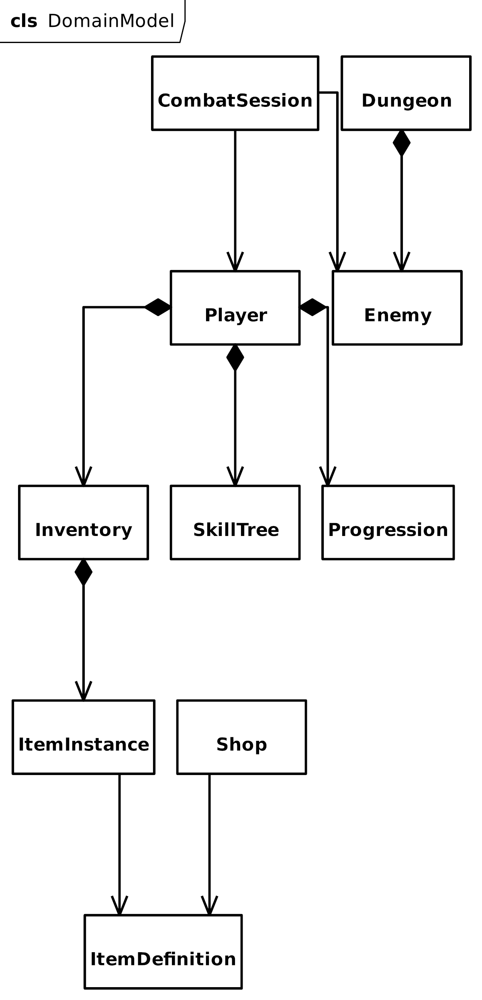

# Cel dokumentu

Dokument definiuje model domenowy gry.

Model domenowy odpowiada za:

- logikę biznesową,
- stan gry,
- reguły,
- obliczenia,
- spójność danych.

Warstwa nie posiada zależności do Godot.

# Założenia

Domain:

- nie zna UI,
- nie zna scen,
- nie zna Godot,
- nie wykonuje save.

Domain publikuje eventy.

# Agregaty



## Player

Główny agregat.

Odpowiedzialność:

- progresja,
- statystyki,
- rozwój,
- wyposażenie,
- walka.

Zawiera:

- [Progression](#Progression)
- [Resources](#Resources)
- [BaseStats](#BaseStats)
- [SkillTree](#SkillTree)
- [Inventory](#Inventory)
- ActiveEffects

## Progression

Odpowiedzialność:

- level,
- xp,
- skill points.

## Resources

Odpowiedzialność:

- hp,
- gold.

## BaseStats

Przechowuje wyłącznie statystyki bazowe.

- HP
- Attack
- Defense
- CriticalChance
- Luck

## SkillTree

Należy do Player.

Zawiera:

- Path
- UnlockedSkills
- Cooldowns

Definicja w pliki: // todo: dodać definicję skilli i skilltree

## Inventory

Odpowiedzialność:

- przechowywanie,
- wyposażenie,
- używanie.

Struktura:

- Equipment
- Items

Equipment:

```
Weapon
Armor
```

Inventory przechowuje:

```
ItemInstance
```

Nie przechowuje:

```
ItemDefinition
```

## ItemDefinition

Definicja przedmiotu.

Struktura:

- Category
- BaseStats
- AllowedClasses
- GenerationRules

## Dungeon

Agregat eksploracji.

Odpowiedzialność:

- progres,
- przeciwnicy,
- interakcje,
- boss.

Struktura:

- Enemies
- Interactions
- Progress
- Boss

Dungeon nie zna `CombatSession`!

## Enemy

Encja enemy.

- EnemyType
- Stats
- Rewards
- StatusEffects

Definicja wrogów: // todo: dodać plik z przeciwnikami

## Shop

Odpowiedzialność:

- generacja oferty,
- sprzedaż,
- kupno.

Struktura:

- Offer
- Pricing

## CombatSession

Obiekt tymczasowy.

Struktura:

- CombatState
- TurnOrder
- Participants
- Effects

# Dynamiczne statystyki

Finalne statystyki nie są zapisywane tylko obliczane jak poniżej:

$$ FinalStats = BaseStats + Equipment + SkillModifiers + TemporaryEffects $$

# Value Objects

## Stats

- Hp
- Attack
- Defense
- CriticalChance
- Luck

## Rarity

- Common
- Rare
- Epic
- Legendary

## Money

tylko gold

# Services

## ItemGenerator

Tworzy ItemInstance.

## StatCalculator

Liczy FinalStats.

## RewardCalculator

Liczy:

- gold,
- exp,
- loot.
