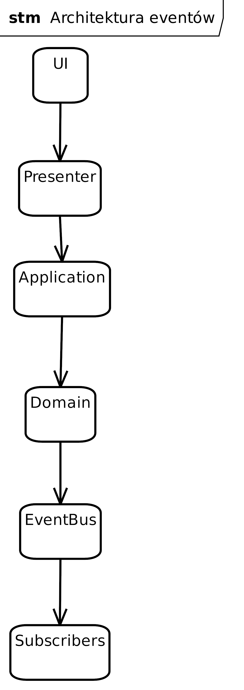
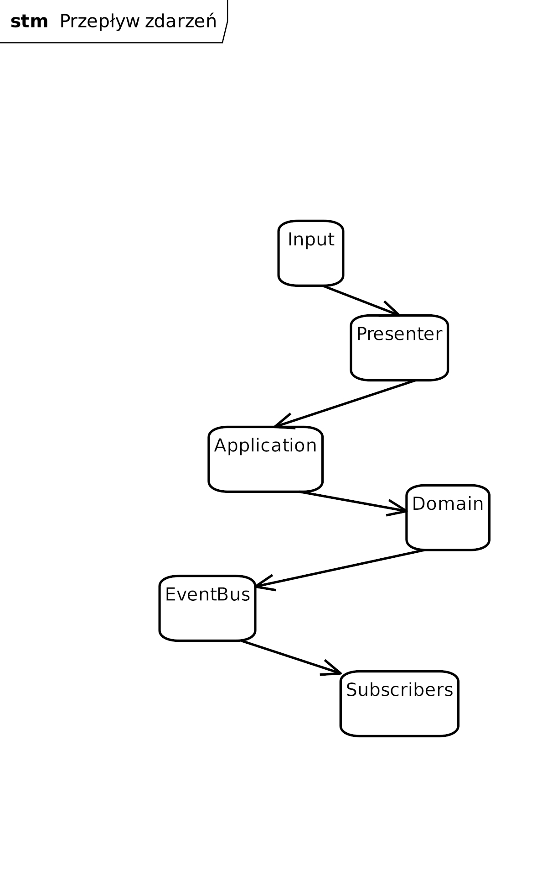
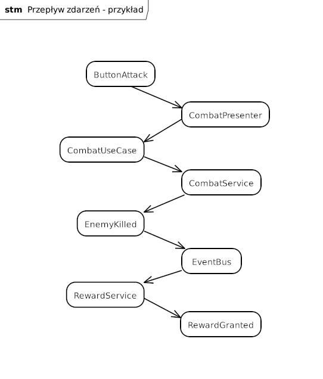

# Cel dokumentu

Dokument definiuje model komunikacji pomiędzy modułami systemu.

System wykorzystuje zdarzenia domenowe do synchronizacji logiki gry bez bezpośrednich zależności pomiędzy modułami.

# Założenia

> Rys. Architektura eventów

# Zasady

1. Eventy są synchroniczne.
2. Event nie zwraca wartości.
3. Błędy nie są eventami.
4. Save wykonywany jest wyłącznie przez Application.
5. Event może posiadać wielu odbiorców.
6. UI nie emituje eventów.
7. Zmiana scen nie odbywa się przez EventBus.

# Podział zdarzeń

## Domain Events

Opisują zdarzenia biznesowe.

Przykłady:

- PlayerLeveledUp
- EnemyKilled
- CombatStarted
- CombatEnded
- PlayerDied
- DungeonCompleted
- ItemDropped

## Application Events

Opisują przepływ aplikacji.

Przykłady:

- SaveRequested
- LoadRequested
- SceneChanged
- ContinueRequested

## UI Events

Nie istnieją.

UI korzysta z Presenter.

# Przepływ

> Rys. Przepływ zdarzeń

# Przykład przepływu

> Rys. Przykładowy przepływ zdzarzeń

# Obsługa błędów

Model: Result

Przykład:

- Success
- Failure
- ValidationError

# Historia eventów

Eventy są zapisywane.

Cel:

- debugowanie,
- analiza sesji,
- testowanie,
- statystyki.

## Zakres

Zapisywane:

- CombatStarted
- EnemyKilled
- PlayerDied
- RewardGranted
- DungeonCompleted
- SaveCreated

Nie zapisujemy:

- UI
- Render
- Input

# Event Store

Model: append only

Operacje:

- Append
- Read
- Clear

# Lista zdarzeń

## Combat

- CombatStarted
- TurnStarted
- ActionSelected
- DamageApplied
- StatusApplied
- StatusExpired
- EnemyKilled
- EscapeSucceeded
- EscapeFailed
- CombatEnded

## Character

- ExperienceGranted
- LevelUp
- SkillUnlocked

## Inventory

- ItemAdded
- ItemRemoved
- ItemEquipped
- ItemConsumed

## Dungeon

- RoomEntered
- RoomCompleted
- DungeonGenerated
- DungeonCompleted

## Save

- SaveRequested
- SaveCompleted
- SaveLoaded

## Player

- PlayerDied
- PlayerRespawned
- GoldChanged

> [!NOTE] Eventy wygenerowane przez AI
> Uzupełnić jak potrzeba
