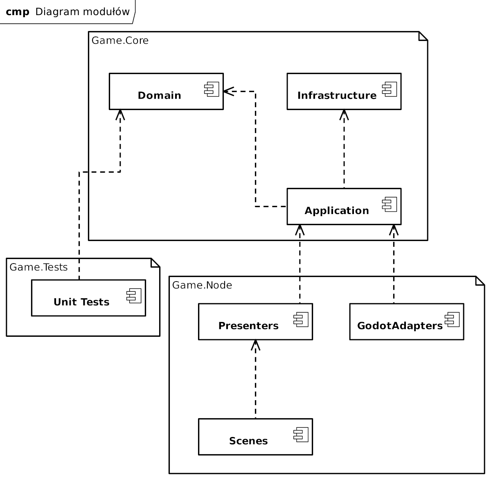

# Cel dokumentu

Dokument definiuje podział odpowiedzialności pomiędzy modułami systemu.

Celem jest utrzymanie wysokiej spójności modułów oraz ograniczenie zależności pomiędzy warstwą logiki i warstwą prezentacji.

# Podział rozwiązania

System składa się z trzech głównych projektów:

```text
Game.Core
Game.Node
Game.Tests
```


> Rys. Diagram modułów

# Game.Core

Warstwa logiki biznesowej.

Nie zawiera zależności od Godot.

Odpowiada za:

- model domenowy,
- reguły gry,
- przebieg rozgrywki,
- zapis i odczyt,
- generowanie danych,
- komunikację domenową.

## Domain

Opisuje obiekty oraz zasady gry.

Zakres:

- Player
- Enemy
- Combat
- Dungeon
- Inventory
- Item
- Quest
- Save

Zasady:

- brak zależności od infrastruktury,
- brak odwołań do UI,
- brak operacji IO.

## Application

Warstwa koordynująca.

Odpowiada za:

- wykonywanie przypadków użycia,
- przepływ danych,
- obsługę zdarzeń.

Przykłady odpowiedzialności:

- rozpoczęcie walki,
- przyznawanie nagród,
- zapis gry,
- generowanie lochu.

## Infrastructure

Warstwa techniczna.

Odpowiada za:

- serializację,
- zapis danych,
- odczyt danych.

Nie zawiera logiki biznesowej.

# Game.Node

Warstwa prezentacji.

Odpowiada za:

- sceny,
- UI,
- assety,
- wejście użytkownika,
- integrację z Godot.

## Scenes

Zawiera strukturę gry.

Przykładowe sceny:

- MainMenu
- SafeHouse
- Dungeon
- Combat
- UI

## Presenters

Łączy UI z logiką.

Odpowiada za:

- odczyt danych z Core,
- mapowanie danych,
- aktualizację widoków.

Nie zawiera reguł gry.

## GodotAdapters

Warstwa integracyjna.

Odpowiada za:

- konwersję danych,
- uruchamianie scen,
- komunikację z silnikiem.

# Game.Tests

Warstwa testów.

Zakres:

- wyłącznie Game.Core.

Testowane obszary:

- Combat
- Loot
- Progression
- Inventory
- Save
- Dungeon

Nie testujemy:

- UI
- scen
- integracji Godot

# Komunikacja pomiędzy modułami

```text
Game.Node

Application

Domain

Domain Events

Application

Presenter

UI
```

# Zależności

Dozwolone:

```text
Game.Node -> Game.Core

Game.Tests -> Game.Core
```

Niedozwolone:

```text
Game.Core !-> Game.Node

Game.Core !-> Godot
```

# Zasady rozwoju projektu

Nowa funkcjonalność powinna:

1. zostać opisana w dokumentacji,
2. otrzymać decyzję architektoniczną jeśli wpływa na strukturę,
3. zostać zaimplementowana w Core,
4. zostać podłączona do Node,
5. otrzymać testy.