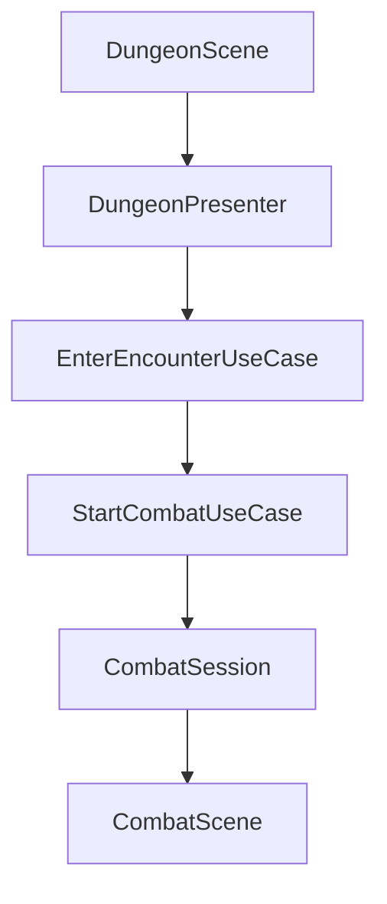
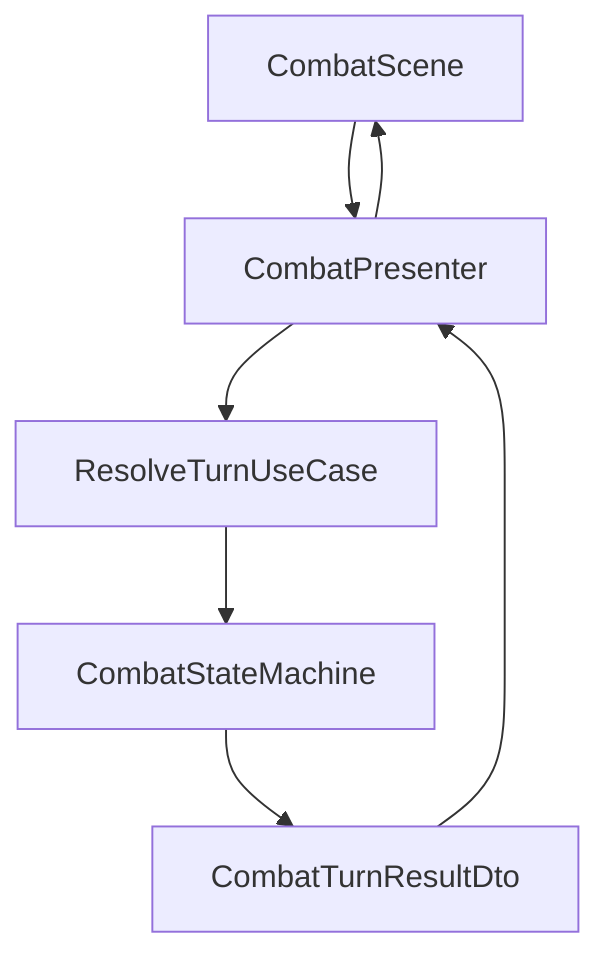
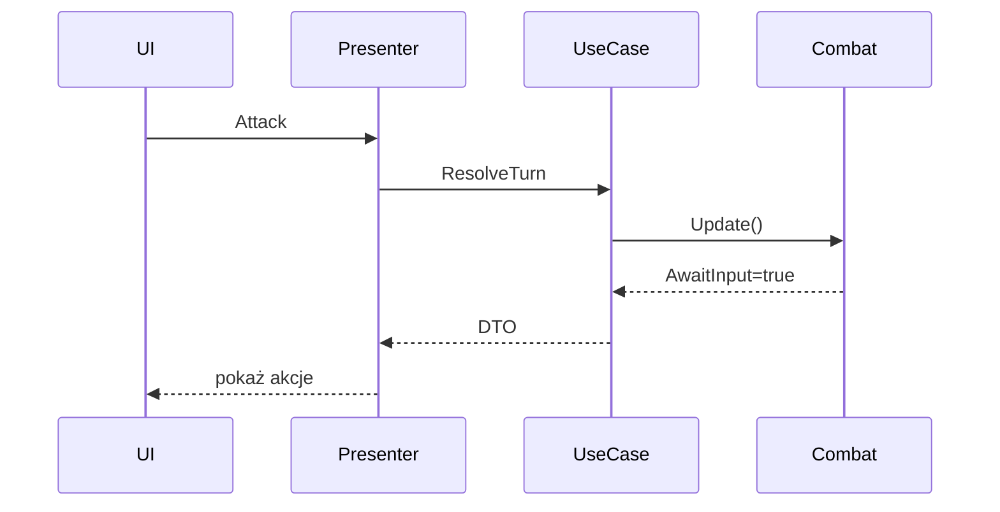
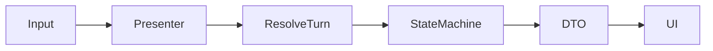

# Integracja Combat z Dungeon i Godot — model przepływu

## Problem

Podczas projektowania Dungeon i Encounter pojawia się pytanie:

> skoro walka działa jako `CombatSession` i posiada własną `CombatStateMachine`, to jak później połączyć to z Godot i UI, które czeka na akcję gracza?

Kluczowa odpowiedź:

**Domain nigdy nie czeka na UI.**

To UI i Presenter sterują kolejnymi wywołaniami use case.

# Rozdział odpowiedzialności

## Dungeon

Reprezentuje świat eksploracji.

Odpowiada za:

- listę encounterów,
- postęp eksploracji,
- wybór kolejnego starcia.

Nie zna:

- CombatSession,
- tur,
- UI.

## Encounter

Reprezentuje pojedyncze zdarzenie bojowe.

Odpowiada za:

- przeciwników,
- stan starcia,
- informację o ukończeniu,
- możliwość odbioru nagrody.

Nie odpowiada za:

- wykonywanie walki,
- kolejność tur,
- input.

## CombatSession

Tymczasowy obiekt runtime.

Żyje wyłącznie podczas walki.

Odpowiada za:

- przebieg walki,
- tury,
- stan walki,
- reward.

Po zakończeniu:

- zostaje usunięty,
- świat pozostaje.

# Najważniejsza zasada

CombatSession NIE należy do Encounter.

Błędny model:

```text
Encounter
└── CombatSession
```

Poprawny model:

```text
Encounter
↓
StartCombatUseCase
↓
CombatSession
↓
FinishCombat
↓
CombatSession usuwana
```

# Przepływ gry

## Wejście do walki



Opis:

1. gracz wchodzi w encounter,
2. Presenter uruchamia use case,
3. tworzona jest CombatSession,
4. Godot przełącza scenę.

# Przepływ jednej tury



Opis:

1. UI wysyła akcję,
2. Use case wykonuje turę,
3. domena zwraca wynik,
4. UI odświeża ekran.

# Jak działa oczekiwanie na akcję gracza

Najważniejsze:

PlayerTurnState NIE czeka.

Nie robimy:

```csharp
while(!selected)
{
}
```

Nie robimy:

```csharp
await WaitForPlayer();
```

Domain nie może blokować.

Poprawny przepływ:



# Co zwraca domena

Przykład:

```text
CombatTurnResultDto
{
    AwaitingPlayerInput=true,
    NextActor="player",
    CombatFinished=false
}
```

UI interpretuje wynik.

Nie domena.

# Kolejna akcja

Gracz klika:

```text
Attack enemy1
```

I cykl uruchamia się od nowa:



# Dlaczego to jest dobre

Korzyści:

- Combat działa bez Godota,
- można testować całość w xUnit,
- UI jest cienkie,
- łatwo dodać AI,
- łatwo zrobić replay,
- brak sprzężenia scen z domeną.

# Reguła do zapamiętania

```text
UI steruje tempem gry.

Domain tylko wykonuje pojedynczy krok.
```

Nie:

```text
Domain czeka na UI.
```

Tylko:

```text
UI wywołuje Domain tyle razy ile potrzeba.
```
