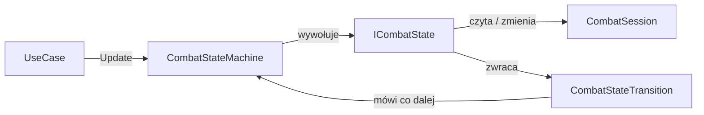
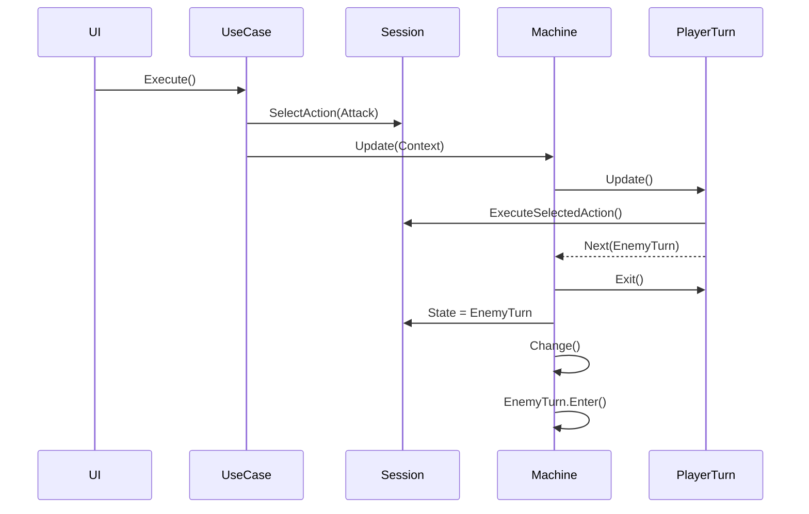
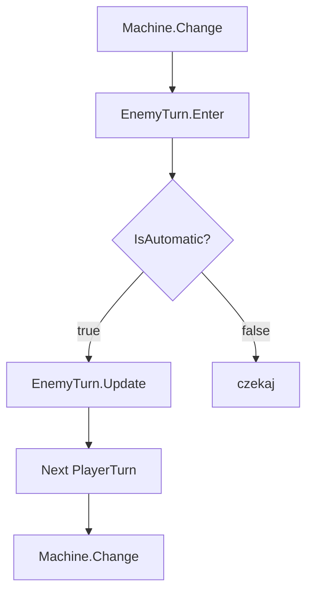
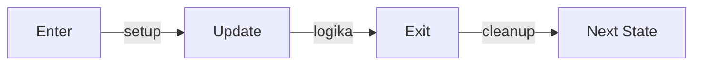
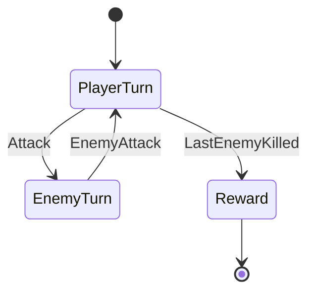

Przepływ walki:

```text
start ->
tura gracza ->
efekty po turze gracza ->
turn przeciwnika ->
efekty po turze przeciwnika ->
powtarzaj ->
nagroda ->
koniec
```

Czyli to jest automat stanów

Każdy stan:

- wiec co ma robić,
- wie kiedy się kończy,
- nie wie co będzie dalej.

Czyli `PlayerTurnState` := "obsługuje turę gracza", a nie `CombatStateMachine` == "robi całą walkę".

## Interfejs

Tworzę interfejs.

```cs
namespace Game.Core.Domain.Combat;

public interface ICombatState
{
    CombatStateType Type { get; }

    void Enter(
        CombatContext context);

    CombatStateTransition Update(
        CombatContext context);

    void Exit(
        CombatContext context);
}
```

### Enter()

Wywoływane raz: "wchodzę do stanu". Na przykład "tura gracza zaczęła się".

### Update()

Wywoływane wiele razy: "czy już skończyliśmy". Przykład: "czy gracz wykonał akcję?".

### Exit()

Wywoływane raz: "sprzątam po stanie". Przykład: "kończę turę".

## Enum stanów

```cs
namespace Game.Core.Domain.Combat;

public enum CombatStateType
{
    Start,
    PlayerTurn,
    PlayerStatus,
    EnemyTurn,
    EnemyStatus,
    Reward,
    End
}
```

To jest tylko identyfikator.

## Transition

`Transition` odpowiada na pytanie: "co robimy dalej?".

```cs
namespace Game.Core.Domain.Combat;

public sealed record CombatStateTransition(
    bool ShouldChange,
    CombatStateType? Next)
{
    public static CombatStateTransition Stay()
    {
        return new(false, null);
    }

    public static CombatStateTransition Next(
        CombatStateType next)
    {
        return new(true, next);
    }
}
```

Przykład:

```text
Stay() = zostań w stanie

Next(PlayerStatus) = przejdź dalej
```

## Context

Zamiast przekazywać 20 parametrów przekazuje `context`.

```cs
namespace Game.Core.Domain.Combat;

public sealed class CombatContext
{
    public CombatSession Session { get; }

    public CombatContext(
        CombatSession session)
    {
        Session = session;
    }
}
```

Czyli zamiast:

```cs
Update(
player,
enemy,
effects,
inventory,
reward)
```

mam:

```cs
Update(context)
```

## Pierwszy stan

```cs
namespace Game.Core.Domain.Combat.States;

public sealed class PlayerTurnState
    : ICombatState
{
    public CombatStateType Type =>
        CombatStateType.PlayerTurn;

    public void Enter(
        CombatContext context)
    {
        context.Session.BeginPlayerTurn();
    }

    public CombatStateTransition Update(
        CombatContext context)
    {
        if (!context.Session.HasSelectedAction)
        {
            return CombatStateTransition.Stay();
        }

        context.Session.ExecuteSelectedAction();

        return CombatStateTransition.Next(
            CombatStateType.PlayerStatus);
    }

    public void Exit(
        CombatContext context)
    {
        context.Session.EndPlayerTurn();
    }
}
```

## Session

Sesja nie jest maszyną stanów. Nie podejmuje decyzji kiedy przejść dalej.

Przykład:

```cs
namespace Game.Core.Domain.Combat;

public sealed class CombatSession
{
    private readonly List<CombatParticipant>
        _participants;

    private CombatAction?
        _selectedAction;

    public CombatStateType State
    {
        get;
        private set;
    }

    public IReadOnlyList<CombatParticipant>
        Participants =>
        _participants;

    public CombatParticipant ActiveParticipant
    {
        get;
        private set;
    }

    public int TurnNumber
    {
        get;
        private set;
    }

    public bool IsFinished
    {
        get;
        private set;
    }

    public CombatReward? Reward
    {
        get;
        private set;
    }

    public bool HasSelectedAction =>
        _selectedAction is not null;


    public CombatSession(
        IEnumerable<CombatParticipant>
            participants)
    {
        _participants =
            participants
                .ToList();

        ActiveParticipant =
            _participants.First();

        TurnNumber = 1;

        State =
            CombatStateType.Start;
    }


    public void BeginPlayerTurn()
    {
        State =
            CombatStateType.PlayerTurn;
    }


    public void SelectAction(
        CombatAction action)
    {
        _selectedAction =
            action;
    }


    public CombatAction ConsumeAction()
    {
        if (_selectedAction is null)
        {
            throw new InvalidOperationException();
        }

        var action =
            _selectedAction;

        _selectedAction =
            null;

        return action;
    }


    public Result ExecuteSelectedAction()
    {
        if (!HasSelectedAction)
        {
            return Result.Fail(
                "No action selected");
        }

        var action =
            ConsumeAction();

        return action.Execute(
            this);
    }


    public void EndPlayerTurn()
    {
        TurnNumber++;

        MoveToNextParticipant();
    }


    public void Finish(
        CombatReward reward)
    {
        Reward =
            reward;

        IsFinished =
            true;

        State =
            CombatStateType.End;
    }


    private void MoveToNextParticipant()
    {
        var current =
            _participants
                .IndexOf(
                    ActiveParticipant);

        var next =
            (current + 1)
            %
            _participants.Count;

        ActiveParticipant =
            _participants[next];
    }
}
```

### Participants

To wszyscy uczestnicy walki.

```text
Player
Goblin
Goblin
EliteGoblin
```

ponieważ każdy przeciwnik ma swoją "podturę".

CombatParticipant nie jest klasą bazową dla np Player czy Enemy bo to złamałoby założenie:

- `Player` i `Enemy` już istnieją w domenie.
    Zamiast dziedziczenia robimy **adapter domenowy do walki**.
    CombatParticipant jest **reprezentacją uczestnika walki**, a nie bazową klasą całej gry.

### ActiveParticipant

Odpowiada na pytanie: "czyja tura".

### SelectedAction

To jest rzecz, którą wybiera UI.

```
Atak
Obron
Skill
Item
```

ale UI wybiera akcję, a domain wykonuje akcję.

### ExecuteSelectedAction

zamiast:

```cs
if attack: then;
	AttackAction
	ItemAction
	SkillAction
	EscapeAction
```

każda wykona się sama czyli: `CombatAction -> Execute()`.

### Finish()

Nie daje nagród tylko, mówi o tym, że walka jest zakończona. Nagrody policzy serwis `RewardCalculator`.

### Przepływ

```text
CombatStartState ->
session.BeginPlayerTurn() ->
PlayerTurnState ->
session.SelectAction() ->
session.ExecuteSelectedAction() ->
PlayerStatusState ->
EnemyTurnState ->
EnemyStatusState
```

> [!NOTE] 
 > `CombatSession` nie zna `EventBus`, `Save`, `Presenter`, `Godot` ani `Scene` bo to już są inne warsty,


### MachineState

Kto steruje przejściami. Nie wykonuje żadnych akcji tylko wchodzi to stanu, wykonuje stan i zmienia stan. To taki dyrygent.


# Kto steruje czym



`StartCombatUseCase` tworzy stateMachine i zwraca go w response.

pozostałe UseCase uruchamiaja `Update` ze stateMachine, stan wykonuje akcję, potem stan zwraca decyzję i stateMachine zmienia stan.

# Gracz klika Atak



Po `Next(EnemyTurn)` nie ma jeszcze ataku przeciwnika tylko: `weszliśmy do EnemyTurn`.

# Automatyczny EnemyTurn



# Co robi Enter / Update / Exit



Przykład:

```text
PlayerTurn  
  
Enter:  
ustaw aktywnego gracza  
  
potem  
  
Update:  
wykonaj Attack  
  
potem  
  
Exit:  
wyczyść akcję
```


# Pełna jedna tura




