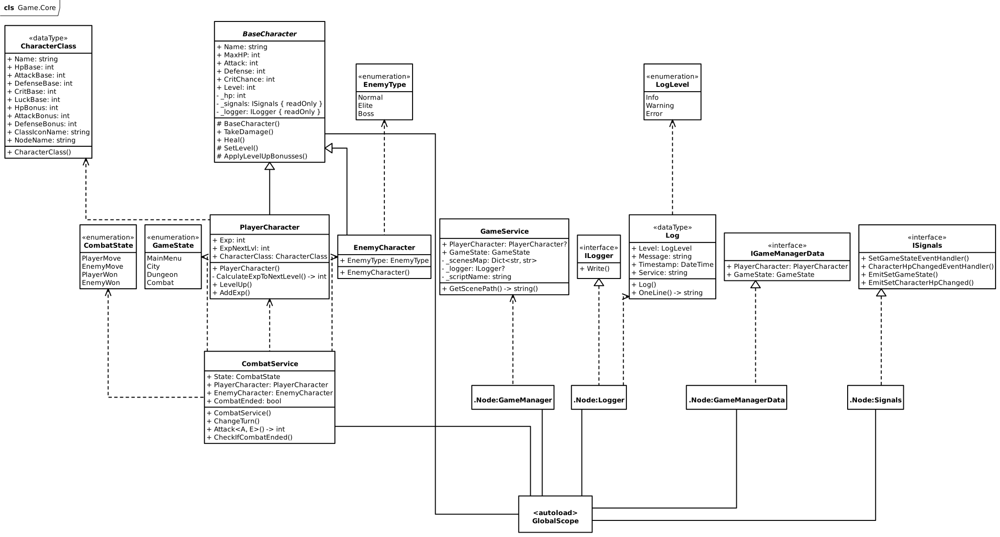
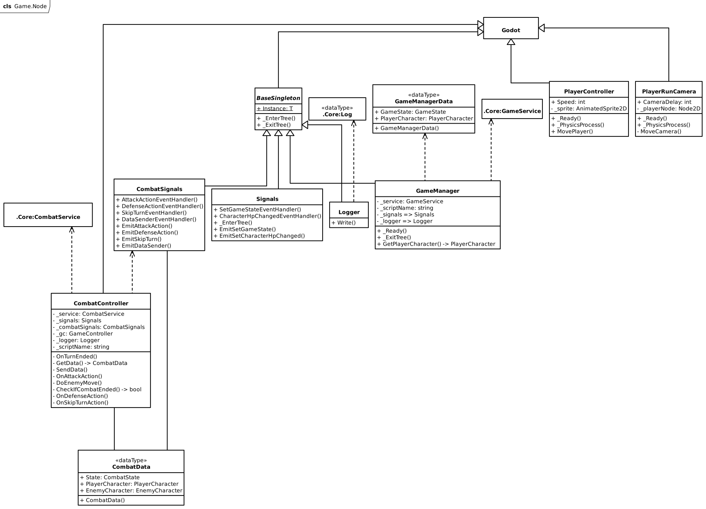
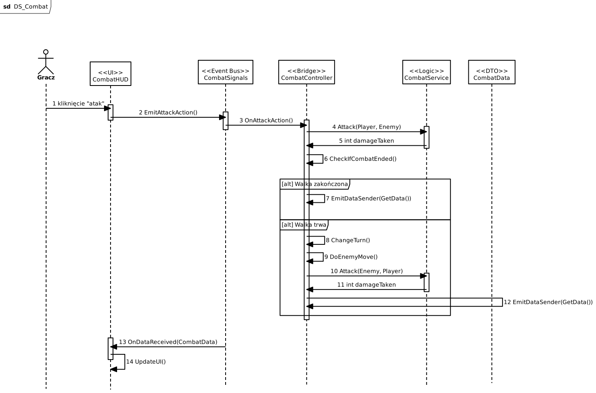
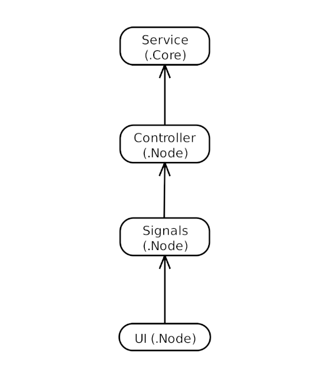
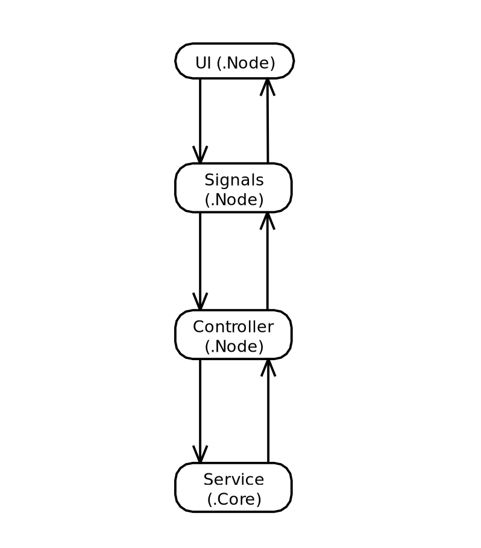

- dodać logo
- spis osób

---

---

# Wprowadzenie

Niniejszy dokument jest dokumentacją gry RPG typu roguelite, która jest produkcją 2D z widokiem top-down, inspirowaną mechanikami znanymi z gier.

## Opis gry

Gracz eksploruje losowo generowane lochy, walczy z przeciwnikami w systemie turowym, zdobywa loot, złoto i rozwija swoją postać. Po śmierci postaci, gracz wraca do miasta (safe house), zachowując część postępów. Gracz kończy grę po ukończeniu pięciu lochów.

## Zespół

- dodać osoby i role tabelkę

---

## Założenia ogólne i stack techniczny

- **Język programowania i technologia**: C# .NET 8.0
- **Silnik gry**: Godot Engine v4.6.1 (Mono)
- **Edytor markdown**: Obsidian

## Zarządzanie projektem

- **system kontroli wersji**: git
- **repozytorium**: [GitHub](https://github.com/orlowski-dev/RPI)
- **zarządzanie zadaniami zespołu**: [Trello](https://trello.com/b/MF4QbxrJ/rpi)

---

# UML

## Game.Core



## Game.Node



### Diagram sekwencji akcji atak



---

# Architektura

## Diagram mentalny



## Ogólna idea architektury

Aby ułatwić sobie życie wprowadzamy podział architektury na warstwy:

- `service` - logika komponentu
- `controller` - pośrednik pomiędzy UI i logiką
- `data` - transport danych
- `signals` - komunikacja
- `ui` - interfejs użytkownika

Każda z tych warstw ma swoją konkretną odpowiedzialność, dzięki czemu kod jest czytelny, modularny i skalowalny.

### Przepływ danych

Rdzeń architektury.



Dla przykładu kliknięci w przycisk w UI, obliczenie danych i wypisanie w UI

UI wysyła sygnał → Controller odbiera → Controller wywołuje Service → Service zwraca wynik → Controller wysyła sygnał (dane) → UI aktualizuje widok

## Implementacja architektury

### Service - logika

Tutaj znajduje się sama logika. `Service` nie może znać `UI` i `Godot`. To musi być czysty `C#`.
Umożliwia nam to pisanie testów jednostkowych i uzywanie logiki gdziekolwiek.

Przykład:

W przypadku walki oblicza obrażenia, sprawdza stan walki i przejścia tur. Nie interesuje go, czy dane są wyświetlane w `HUD`, `logów` czy animacji.

Service przyjmuje dane i zwraca wynik.

### Data - transport danych (DTO)

Skoro Service nie zna UI, potrzebujemy struktury danych, która będzie przenosić informacje między systemami, dlatego tworzymy klasę Data.

Przykład:

CombatData może zawierać:

- stan walki
- gracza
- przeciwnika
- informacje o turze

Ta klasa nie powinna zawierać logiki. To tylko kontener danych.

### Signals - komunikacja

Signals odpowiadają za komunikację między systemami, dzięki czemu `UI` nie musi znać `Controllera` - więc nie ma tutaj zależności.

`UI` wysyła signał, a `Controller` go odbiera.

Sygnały nie powinny zawierać logiki. To tylko komunikacja.

### Controller - bridge

Controller to most między Godot a Core.

- odbiera sygnały
- wywołuje `service`
- wysyła sygnały

`Controller` nie powinien zawierać logiki gry, to tylko koordynator.

`Controller` musi posiada instancję `Service`:

```cs
private readonly CombatService _service = new();
```

to ona zarządza logiką.

### UI

`UI` nie może znać logiki, wywoływać `service` i znać `controlera`. Wysyła tylko sygnały, odbieraj je, aktualizuje widok itd.

---

# Klasy

## BaseCharacter

Bazowa klasa dla wszystkich postaci w grze.  
Definiuje podstawowe statystyki używane w systemie walki.

```csharp
public abstract partial class BaseCharacter
```

### Opis

`BaseCharacter` jest klasą abstrakcyjną przechowującą wspólne właściwości postaci oraz  
podstawową logikę związaną z:

- obrażeniami
- leczeniem
- aktualizacją HP
- sygnałami zmian HP

### Właściwości

| Właściwość | Typ       | Dostęp            | Opis                              |
| ---------- | --------- | ----------------- | --------------------------------- |
| Name       | string    | public            | Nazwa postaci                     |
| MaxHP      | int       | public            | Maksymalne punkty życia           |
| HP         | int       | public            | Aktualne punkty życia             |
| Attack     | int       | public            | Siła ataku                        |
| Defense    | int       | public            | Obrona                            |
| CritChance | int       | public            | Szansa na trafienie krytyczne (%) |
| Level      | int       | public            | Poziom przeciwnika                |
| \_hp       | int       | private           | Zmienna potrzebna dla settera HP  |
| \_signals  | ISignals? | readonly, private | Referencja do instancji Signal    |
| \_logger   | ILogger?  | readonly, private | Referencja do instancji Logger    |

### Konstruktory

| Parametr   | Typ       | Opis                           |
| ---------- | --------- | ------------------------------ |
| name       | string    | Nazwa postaci                  |
| maxHp      | int       | Maksymalne HP                  |
| attack     | int       | Siła ataku                     |
| defense    | int       | Obrona                         |
| luck       | int       | Szczęście                      |
| critChance | int       | Szansa na trafienie krytyczne  |
| level      | int       | Poziom postaci                 |
| signals    | ISignals? | Referencja do instancji Signal |

### Metody

#### TakeDamage

```csharp
public virtual void TakeDamage(int amount)
```

Zmniejsza HP postaci o podaną wartość.

##### Parametry

| Parametr | Typ | Opis          |
| -------- | --- | ------------- |
| amount   | int | Ilość obrażeń |

#### Heal

```csharp
public virtual void Heal(int amount)
```

Leczy postać o podaną wartość.

##### Parametry

| Parametr | Typ | Opis           |
| -------- | --- | -------------- |
| amount   | int | Ilość leczenia |

#### SetLevel

Setter dla Level

```cs
protected void SetLevel(int newLvl)
```

##### Parametry

| Parametr | Typ | Opis               |
| -------- | --- | ------------------ |
| newLvl   | int | Nowa wartość (lvl) |

---

## PlayerCharacter

Reprezentuje statystyki postaci gracza w grze.

```csharp
public partial class PlayerCharacter : BaseCharacter
```

### Opis

`PlayerCharacter` przechowuje podstawowe statystyki gracza.

### Dziedziczenie

```bash
BaseCharacter <-- PlayerCharacter
```

### Statystyki bazowe (dziedziczone)

| Właściwość | Typ       | Dostęp            | Opis                              |
| ---------- | --------- | ----------------- | --------------------------------- |
| Name       | string    | public            | Nazwa postaci                     |
| MaxHP      | int       | public            | Maksymalne punkty życia           |
| HP         | int       | public            | Aktualne punkty życia             |
| Attack     | int       | public            | Siła ataku                        |
| Defense    | int       | public            | Obrona                            |
| CritChance | int       | public            | Szansa na trafienie krytyczne (%) |
| Level      | int       | public            | Poziom przeciwnika                |
| \_hp       | int       | private           | Zmienna potrzebna dla settera HP  |
| \_signals  | ISignals? | readonly, private | Referencja do instancji Signal    |
| \_logger   | ILogger?  | readonly, private | Referencja do instancji Logger    |

### Statystyki gracza

| Właściwość | Typ | Dostęp | Opis                                     |
| ---------- | --- | ------ | ---------------------------------------- |
| Exp        | int | public | Aktualne punkty doświadczenia            |
| ExpNextLvl | int | public | Wymagana ilość EXP do następnego poziomu |
| Luck       | int | public | Szczęście                                |

### Konstruktor

| Parametr   | Typ       | Opis                           |
| ---------- | --------- | ------------------------------ |
| name       | string    | Nazwa postaci                  |
| maxHp      | int       | Maksymalne HP                  |
| attack     | int       | Siła ataku                     |
| defense    | int       | Obrona                         |
| luck       | int       | Szczęście                      |
| critChance | int       | Szansa na trafienie krytyczne  |
| level      | int       | Poziom postaci                 |
| signals    | ISignals? | Referencja do instancji Signal |
| logger     | ILogger?  | Referencja do instancji Logger |

### Metody

#### CalculateExpToNextLevel

```csharp
private int CalculateExpToNextLevel()
```

Oblicza ilość doświadczenia wymaganą do osiągnięcia następnego poziomu.

#### LevelUp

```csharp
private void LevelUp(int levels = 1)
```

Zwiększa poziom postaci oraz aktualizuje wymagane doświadczenie do osiągnięcia następnego poziomu.

##### Parametry

| Parametr | Typ | Opis           |
| -------- | --- | -------------- |
| levels   | int | Ilość poziomów |

#### AddExp

```csharp
public void AddExp(int amount)
```

Dodaje punkty doświadczenia i zwiększa Level jeśli potrzeba.

##### Parametry

| Parametr | Typ | Opis                 |
| -------- | --- | -------------------- |
| amount   | int | Ilość Exp do dodania |

---

## CharacterClass

Struktura przechowująca definicję klasy postaci wraz z bazowymi statystykami i bonusami przy awansie poziomu.

```cs
public readonly struct CharacterClass
```

### Opis

CharacterClass jest niezmienialną strukturą przechowującymi statystyki bazowe dla danej klasy postaci. Zawiera informacje o:

- bazowych wartościach statystyk,
- bonusach przy level-up,
- nazwie i ikonie klasy.

### Właściwości

| Właściwość    | Typ    | Dostęp | Opis                                     |
| ------------- | ------ | ------ | ---------------------------------------- |
| Name          | string | public | Nazwa klasy postaci                      |
| HpBase        | int    | public | Bazowe punkty życia                      |
| AttackBase    | int    | public | Bazowa siła ataku                        |
| DefenseBase   | int    | public | Bazowa obrona                            |
| CritBase      | int    | public | Bazowa szansa na trafienie krytyczne (%) |
| LuckBase      | int    | public | Bazowe szczęście                         |
| ClassIconName | string | public | Nazwa pliku ikony klasy                  |
| HpBonus       | int    | public | Bonus do HP przy każdym level-up         |
| AttackBonus   | int    | public | Bonus do ataku przy każdym level-up      |
| DefenseBonus  | int    | public | Bonus do obrony przy każdym level-up     |
| NodeName      | string | public | Nazwa sceny z postacią gracza            |

### Konstruktor

| Parametr      | Typ     | Opis                                                      |
| ------------- | ------- | --------------------------------------------------------- |
| name          | string  | Nazwa klasy postaci                                       |
| hpBase        | int     | Bazowe punkty życia                                       |
| attackBase    | int     | Bazowa siła ataku                                         |
| defenseBase   | int     | Bazowa obrona                                             |
| critBase      | int     | Bazowa szansa na trafienie krytyczne (%)                  |
| luckBase      | int     | Bazowe szczęście                                          |
| hpBonus       | int     | Bonus do HP przy każdym level-up                          |
| attackBonus   | int     | Bonus do ataku przy każdym level-up                       |
| defenseBonus  | int     | Bonus do obrony przy każdym level-up                      |
| classIconName | string? | Nazwa pliku ikony klasy (domyślnie `null` → pusty string) |
| NodeName      | string? | Nazwa sceny z postacią gracza                             |

---

## EnemyCharacter

Reprezentuje statystyki przeciwnika w grze.

```csharp
public partial class EnemyCharacter : BaseCharacter
```

### Opis

`EnemyCharacter` przechowuje podstawowe statystyki przeciwnika.

### Dziedziczenie

```bash
BaseCharacter <-- EnemyCharacter
```

### Statystyki bazowe (dziedziczone)

| Właściwość | Typ       | Dostęp            | Opis                              |
| ---------- | --------- | ----------------- | --------------------------------- |
| Name       | string    | public            | Nazwa postaci                     |
| MaxHP      | int       | public            | Maksymalne punkty życia           |
| HP         | int       | public            | Aktualne punkty życia             |
| Attack     | int       | public            | Siła ataku                        |
| Defense    | int       | public            | Obrona                            |
| CritChance | int       | public            | Szansa na trafienie krytyczne (%) |
| Level      | int       | public            | Poziom przeciwnika                |
| \_hp       | int       | private           | Zmienna potrzebna dla settera HP  |
| \_signals  | ISignals? | readonly, private | Referencja do instancji Signal    |
| \_logger   | ILogger?  | readonly, private | Referencja do instancji Logger    |

### Statystyki

| Właściwość | Typ       | Dostęp | Opis            |
| ---------- | --------- | ------ | --------------- |
| EnemyType  | EnemyType | public | Typ przeciwnika |

### Konstruktor

| Parametr   | Typ       | Opis                           |
| ---------- | --------- | ------------------------------ |
| name       | string    | Nazwa przeciwnika              |
| maxHp      | int       | Maksymalne HP                  |
| attack     | int       | Siła ataku                     |
| defense    | int       | Obrona                         |
| critChance | int       | Szansa na trafienie krytyczne  |
| enemyType  | EnemyType | Typ przeciwnika                |
| level      | int       | Poziom postaci                 |
| signals    | ISignals? | Referencja do instancji Signal |

---

## PlayerController

Odpowiada za sterowanie postacią gracza.

```csharp
public partial class PlayerController : CharacterBody2D
```

### Dziedziczenie

```bash
CharacterBody2D <-- PlayerController
```

Klasa dziedziczy po `CharacterBody2D`. Wykorzystuje system fizyki.
Obsługuje:

- ruch gracza
- rotację
- fizykę ruchu
- pobieranie inputu

### Parametry

| Parametr      | Typ | Opis             |
| ------------- | --- | ---------------- |
| Speed         | int | Prędkość ruchu   |
| RotationSpeed | int | Prędkość rotacji |

### Metody

#### MovePlayer()

```csharp
private void MovePlayer(ref double delta)
```

Metoda odpowiedzialna za:

- pobieranie wejścia gracza,
- poruszanie się postacią,
- płynną rotację postaci,
- wywołanie fizyki ruchu.

Pobiera kierunek z `InputMap`. Akcje:

- moveLeft
- moveRight
- moveUp
- moveDown

---

## PlayerRunCamera

Odpowiada za śledzenie gracza w lochach. Kamera płynnie podąża za postacią gracza.

```csharp
public partial class PlayerRunCamera : Camera2D
```

### Opis

Kamera automatycznie wyszukuje obiekt `Player` w drzewie sceny.

### Dziedziczenie

```bash
Camera2D <-- PlayerRunCamera
```

Klasa dziedziczy po `Camera2D` i automatycznie wyszukuje obiekt `Player` w drzewie sceny.

> [!CAUTION]
> Jeżeli Player nie zostanie znaleziony to wypisze błąd w konsoli i skrypt zostanie przerwany.
>
> -   player node musi mieć nazwę "Player"
> -   kamera musi być w tym samym `RootNode`

### Właściwości

| Parametr        | Typ    | Dostęp     | Opis                         |
| --------------- | ------ | ---------- | ---------------------------- |
| [E] CameraDelay | int    | public set | Płynność ruchu kamery        |
| \_playerNode    | Node2D | private    | Referencja do obiektu gracza |

### Metody

#### MoveCamera()

```csharp
private void MoveCamera(ref double delta)
```

Metoda odpowiada za:

- śledzenie gracza,
- płynny ruch kamery.

---

## BaseSingleton

Bazowa klasa singleton dla systemów globalnych w grze.

```csharp
public abstract partial class BaseSingleton<T> : Node where T : Node
```

### Dziedziczenie

```bash
Node <-- BaseSingleton
```

### Opis

`BaseSingleton<T>` to generyczna klasa abstrakcyjna implementująca wzorzec **Singleton**  
dla klas dziedziczących po `Node`.

Klasa automatycznie:

- pilnuje jednej instancji
- ustawia `Instance`
- usuwa duplikaty
- czyści referencję przy usuwaniu node

Klasa implementuje:

- Singleton Pattern
- Generic Singleton

### Właściwości

| Właściwość | Typ | Dostęp | Opis                          |
| ---------- | --- | ------ | ----------------------------- |
| Instance   | T   | static | Globalna instancja singletona |

### Przykład użycia

```csharp
public partial class GameController : BaseSingleton<GameController>
{
	public override void _EnterTree()
	{
		base._EnterTree();
		// dalsza implementacja
	}
}
```

---

## GameManager

Główny kontroler gry.

```csharp
public partial class GameManager : BaseSingleton<GameManager>
```

### Dziedziczenie

```bash
Node <-- BaseSingleton <-- GameController
```

### Właściwości

| Właściwość   | Typ         | Dostęp  | Opis                            |
| ------------ | ----------- | ------- | ------------------------------- |
| \_service    | GameService | private | Instancja logiki komponentu     |
| \_scriptName | string      | private | Nazwa skryptu dla loggera       |
| \_signals    | Signals     | private | Referencja do instancji Signals |
| \_logger     | Logger      | private | Referencja do instancji Logger  |

### Metody

#### OnGameStateChganged

```csharp
private void OnSetGameState(GameManagerData data)
```

Obsługuje zmianę stanu gry.

Metody

#### GetPlayerCharacter

```csharp
public PlayerCharacter GetPlayerCharacter()
```

Zwraca wartość zmiennej PlayerCharacter z `GameService`.

---

## Signals

Globalny EventBus aplikacji.

```csharp
public partial class Signals : BaseSingleton<Signals>, ISignals
```

### Opis

Centralny system komunikacji pomiędzy modelami i kontrolerami.

### Dziedziczenie

```bash
Node <-- BaseSingleton <-- Signals
```

### Sygnały

#### SetGameState

```csharp
[Signal]
public delegate void SetGameStateEventHandler(GameState newState);
```

Zmienia stan gry.

#### CharacterHpChangedEventHandler

```cs
[Signal]
public delegate void CharacterHpChangedEventHandler(int hp);
```

Wywoływany przy zmianie punktów życia

### Metody

#### EmitSetGameState

```csharp
public void EmitSetGameState(GameState newState)
```

Emituje sygnał zmiany stanu gry.

#### EmitSetCharacterHpChanged

```cs
public void EmitSetCharacterHpChanged(int newHp)
{
    EmitSignal(SignalName.CharacterHpChanged, newHp);
}
```

Emituje sygnał zmiany wartości hp postaci.

---

## UIManager

```csharp
public partial class UIManager : BaseSingleton<UIManager>
```

### Dziedziczenie

```bash
Node <-- BaseSingleton <-- UIManager
```

---

## FileSystem

Singleton odpowiedzialny za pracę z plikami.

```csharp
public sealed partial class FileSystem : BaseSingleton<FileSystem>
{
}
```

Implementacja wykorzystuje `Godot.FileAccess`.

### Metody

#### Write

Metoda odpowiada za zapis danych do pliku. Tworzenie pliku jeśli plik nie istnieje lub
dopisuje dane do istniejącego wskazanego pliku.

```csharp
public void Write(string path, string content)
```

##### Parametry

| Parametr | Typ    | Opis                           |
| -------- | ------ | ------------------------------ |
| path     | string | Ścieżka do pliku               |
| content  | string | Zawartość do zapisania w pliku |

---

## Read
Odczytuje zawartość pliku.

```csharp
public string Read(string path)
```
## Exists
Sprawdza, czy plik istnieje.

```csharp
public bool Exists(string path)
```


## Logger

```cs
public partial class Logger : BaseSingleton<Logger>, ILogger
```

### Dziedziczenie

```bash
Node <-- BaseSingleton <-- Logger
```

### Metody

#### Write

Metoda opowiadająca za zapis logu do pliku i wypisanie go w konsoli.

##### Parametry

| Parametr | Typ      | Opis                  |
| -------- | -------- | --------------------- |
| level    | LogLevel | Rodzaj logu           |
| service  | string   | Nazwa serwisu/skryptu |
| message  | string   | Treść wiadomości      |

---

## CombatService

Serwis odpowiedzialny za logikę walki w grze.  
Zarządza turami, obliczaniem obrażeń oraz sprawdzaniem zakończenia walki.

### Właściwości

| Właściwość      | Typ             | Dostęp | Opis                             |
| --------------- | --------------- | ------ | -------------------------------- |
| State           | CombatState     | public | Aktualny stan walki              |
| PlayerCharacter | PlayerCharacter | public | Statystyki postaci gracza gracza |
| Enemy           | EnemyCharacter  | public | Przeciwnik                       |
| CombatEnded     | bool            | public | Czy walka została zakończona     |

### Konstruktor

```cs
public CombatService(
    PlayerCharacter playerCharacter,
    EnemyCharacter enemy,
    bool playerBegins = true
)
```

| Parametr        | Typ             | Opis                                        |
| --------------- | --------------- | ------------------------------------------- |
| playerCharacter | PlayerCharacter | Postać gracza                               |
| enemy           | EnemyCharacter  | Przeciwnik                                  |
| playerBegins    | bool            | Określa kto zaczyna walkę (domyślnie gracz) |

### Metody

#### ChangeTurn

```cs
public void ChangeTurn()
```

Zmienia turę pomiędzy graczem a przeciwnikiem.

#### Attack

```cs
public int Attack<A, E>(A attacker, E enemy, bool defenseAction = false, bool crit = false)
    where A : BaseCharacter
    where E : BaseCharacter
```

Wykonuje atak pomiędzy postaciami i oblicza obrażenia.

##### Parametry

| Parametr      | Typ           | Opis                        |
| ------------- | ------------- | --------------------------- |
| attacker      | BaseCharacter | Atakująca postać            |
| enemy         | BaseCharacter | Postać broniąca się         |
| defenseAction | bool          | Czy przeciwnik używa obrony |
| crit          | bool          | Czy atak jest krytyczny     |

##### Zwraca

| Typ | Opis             |
| --- | ---------------- |
| int | Zadane obrażenia |

##### Logika obrażeń

- Bazowe obrażenia = Attack
- Jeśli obrona to obrażenia \* 0.5
- Odejmowana jest połowa Defense przeciwnika
- Jeśli trafienie krytyczne to obrażenia \* 1.5
- Obrażenia są aplikowane do przeciwnika

#### CheckIfCombatEnded

```cs
private void CheckIfCombatEnded()
```

Sprawdza czy walka została zakończona.

---

## GameService

Serwis odpowiedzialny za logikę rozgrywki. Przechowuje zmienne, które mają być dostępne globalnie.

### Właściwości

| Właściwość      | Typ              | Dostęp      | Opis                               |
| --------------- | ---------------- | ----------- | ---------------------------------- |
| GameState       | GameState        | public      | Aktualny stan gry                  |
| PlayerCharacter | PlayerCharacter? | public      | Statystyki postaci gracza gracza   |
| \_scenesMap     | Dict<str, str>   | private     | Mapa nazwa sceny, ścieżka do sceny |
| \_scriptName    | string           | private     | Nazwa skryptu                      |
| \_logger        | ILogger?         | private, ro | Zależność do Logger                |

### Konstruktor

```cs
public GameService(ILogger? logger = null)
```

| Parametr | Typ      | Opis                |
| -------- | -------- | ------------------- |
| logger   | ILogger? | Zależność do Logger |

### Metody

#### GetScenePath

```cs
public string GetScenePath(IGameManagerData data)
```

Zwraca ścieżkę do sceny w zależności od stanu rozgrywki.

---

## CombatSignals

Singleton odpowiedzialny za komunikację pomiędzy komponentami systemu walki.

```cs
public partial class CombatSignals : BaseSingleton<CombatSignals>
```

Pełni rolę EventBus dla systemu walki.

### Sygnały

#### AttackAction

```cs
[Signal]
public delegate void AttackActionEventHandler();
```

Emitowany gdy gracz wybierze atak.

#### DefenseAction

```cs
[Signal]
public delegate void DefenseActionEventHandler();
```

Emitowany gdy gracz wybierze obronę.

#### SkipTurn

```cs
[Signal]
public delegate void SkipTurnEventHandler();
```

Emitowany gdy gracz pominie turę.

#### DataSender

```cs
[Signal]
public delegate void DataSenderEventHandler(CombatData combatData);
```

Wysyła dane walki do UI.

### Emitery

#### EmitAttackAction

```cs
public void EmitAttackAction()
```

Emitowanie ataku.

#### EmitDefenseAction

```cs
public void EmitDefenseAction()
```

Emitowanie obrany,

#### EmitSkipTurn

```cs
public void EmitSkipTurn()
```

Emitowanie pominięcia tury.

#### EmitDataSender

```cs
public void EmitDataSender(CombatData combatData)
```

Wysyłanie danych walki.

---

## CombatController

Kontroler zarządzający przebiegiem walki.

```cs
public partial class CombatController : Node
```

### Właściwości

| Pole            | Typ            | Opis             |
| --------------- | -------------- | ---------------- |
| \_service       | CombatService  | Logika walki     |
| \_signals       | Signals        | Globalne sygnały |
| \_combatSignals | CombatSignals  | Sygnały walki    |
| \_gc            | GameController | GameController   |
| \_scriptName    | string         | Nazwa skryptu    |

### Metody

#### GetData

```cs
private CombatData GetData()
```

Tworzy obiekt danych walki.

#### SendData

```cs
private void SendData()
```

Wysyła dane walki do UI.

#### OnTurnEnded

```cs
private void OnTurnEnded()
```

Kończy turę i wysyła dane.

#### OnAttackAction

```cs
private void OnAttackAction()
```

Obsługuje atak gracza.

#### DoEnemyMove

```cs
private async void DoEnemyMove(bool defenseAction = false)
```

Wykonuje ruch przeciwnika.

#### OnDefenseAction

```cs
private void OnDefenseAction()
```

Obsługa obrony gracza.

#### OnSkipTurnAction

```cs
private void OnSkipTurnAction()
```

Obsługa pominięcia tury.

#### CheckIfCombatEnded

```cs
private bool CheckIfCombatEnded()
```

Sprawdza zakończenie walki.

---

## CombatData

Obiekt danych wykorzystywany do przekazywania aktualnego stanu walki pomiędzy komponentami systemu walki.

```cs
public partial class CombatData : GodotObject
```

Klasa DTO przechowującą dane potrzebne do:

- aktualizacji UI walki
- synchronizacji stanu walki
- komunikacji CombatController → CombatHUD

Klasa nie zawiera logiki.

### Dziedziczenie

```bash
GodotObject <-- CombatData
```

Klasa dziedziczy po GodotObject poniważ umożliwia to przekazywanie klasy przez sygnały.

### Właściwości

| Właściwość      | Typ             | Dostęp | Opis                      |
| --------------- | --------------- | ------ | ------------------------- |
| State           | CombatState     | public | Aktualny stan walki       |
| PlayerCharacter | PlayerCharacter | public | Statystyki postaci gracza |
| Enemy           | EnemyCharacter  | public | Przeciwnik                |

### Konstruktor

```cs
public CombatData(
    CombatState state,
    PlayerCharacter playerCharacter,
    EnemyCharacter enemy
)
```

#### Parametry

| Parametr        | Typ             | Opis                |
| --------------- | --------------- | ------------------- |
| state           | CombatState     | Aktualny stan walki |
| playerCharacter | PlayerCharacter | Postać gracza       |
| enemy           | EnemyCharacter  | Przeciwnik          |

---

## GameManagerData

Obiekt danych wykorzystywany do przekazywania aktualnego stanu gry.

```cs
public partial class GameManagerData : GodotObject, IGameManagerData
```

### Dziedziczenie

```bash
GodotObject <-- CombatData
```

Klasa dziedziczy po GodotObject poniważ umożliwia to przekazywanie klasy przez sygnały.

### Właściwości

| Właściwość      | Typ             | Dostęp | Opis                      |
| --------------- | --------------- | ------ | ------------------------- |
| GameState       | GameState       | public | Aktualny stan gry         |
| PlayerCharacter | PlayerCharacter | public | Statystyki postaci gracza |

### Konstruktor

```cs
public GameManagerData(GameState gameState, PlayerCharacter playerCharacter = null)
```

#### Parametry

| Parametr        | Typ             | Opis                |
| --------------- | --------------- | ------------------- |
| gameState       | GameState       | Aktualny stan walki |
| playerCharacter | PlayerCharacter | Postać gracza       |

---

# Wyliczniki

## GameState

Enum określający aktualny stan gry.

## LogLevel

Enum określający typ logu

## EnemyType

Enum określający typ przeciwnika.

## CombatState

Enum definiujący aktualny stan walki.

```cs
public enum CombatState
{
	PlayerMove,
	EnemyMove,
	PlayerWon,
	EnemyWon,
}
```

### Opis

`CombatState` określa aktualną fazę walki:

| Wartość    | Opis                    |
| ---------- | ----------------------- |
| PlayerMove | Tura gracza             |
| EnemyMove  | Tura przeciwnika        |
| PlayerWon  | Gracz wygrał walkę      |
| EnemyWon   | Przeciwnik wygrał walkę |

---

# Struktury

## Log

Struktura reprezentująca pojedynczy wpis logu systemowego.

```cs
public readonly struct Log
```

### Właściwości

| Właściwość | Typ      | Dostęp | Opis                                          |
| ---------- | -------- | ------ | --------------------------------------------- |
| Level      | LogLevel | public | Rodzaj logu                                   |
| Message    | string   | public | Treść wiadomości                              |
| Timestamp  | string   | public | Data i czas utworzenia                        |
| Service    | string   | public | Nazwa systemu lub komponentu generującego log |

### Konstruktory

| Parametr  | Typ      | Opis                                          |
| --------- | -------- | --------------------------------------------- |
| level     | string   | Rodzaj logu                                   |
| message   | int      | Treść wiadomości                              |
| timestamp | DateTime | Data i czas utworzenia                        |
| service   | string   | Nazwa systemu lub komponentu generującego log |

### Metody

#### OneLine

Zwraca log w formacie jednej linii tekstu.

```cs
public string OneLine => ()
```

W formacie:

```
Timestamp | Level | Service | Message
```

### Przykład użycia

```cs
Logger.Write(LogLevel.Info, this.GetType().Name, "To jest zwykła informacja");
// 31.03.2026 20:32:30 | Info | TestUIController | To jest zwykła informacja
```

---

# Interfejsy

## ISignals

Interfejs sygnałów globalnych.

> [!WARNING]
> Każdy sygnał i metoda emitująca muszą zostać zdefiniowane najpierw tutaj i potem zaimplementowane w EventBus (Signals)

## ILogger

Interfejs dla Logger.

```cs
public interface ILogger
{
    public void Write(LogLevel level, string service, string message);
}
```

## IGameManagerData

```cs
public interface IGameManagerData
{
    public PlayerCharacter PlayerCharacter { get; init; }
    public GameState GameState { get; init; }
}
```

Interfejs dla klasy GameManagerData.

Dane przekazywane przez sygnały muszą dziedziczyć po `Godot:GodotObject`, stąd ten interfejs.

Wykorzystywany np. w `ISignals` do zdefiniowania parametrów sygnału w `Game.Core`.

---

# Jak używać Custom Singals?

Czyli takie luźne powiązanie systemów. Zamiast robić referencje do kontrolerów itd to możemy sobie puścić sygnał i go łatwo obsłużyć.

Custom signals pozwalają:

- oddzielić logikę systemów
- uniknąć bezpośrednich zależności
- łatwo komunikować się między scenami
- tworzyć skalowalną architekturę

## Rejestracja nowego sygnału

Należy dodać **sygnał** do klasy `Signals`

```csharp
// plik: Signals.cs

[Signal]
public delegate void NazwaSygnałuEventHandler(<lista parametrów lub bez>);
```

> [!WARNING]
> Nazwa sygnału musi kończyć się na **EventHandler** - inaczej nie zadziała!

## Metoda emitująca sygnał

Należy utworzyć metodą, która wyemituje ten sygnał.

```csharp
// plik: Signals.cs

public void EmitNazwaSygnału(int value)
{
	EmitSignal(SignalName.NazwaSygnału, value);
}
```

## Nasłuchiwanie sygnału

### Utworzenie referencji do `Signal`

```csharp
// plik: twój, w którym chcesz skorzystać z sygnału
private Signals _signals => Signals.Instance;
```

### Utworzenie metody obsługującej sygnał

Trzeba utworzyć metodę, która zostanie "podpięta" do sygnały i zostanie wykonana kiedy sygnał się pojawi.

```csharp
// plik: twój, w którym chcesz skorzystać z sygnału

private void OnNazwaSygnału(GameState newState)
{
	GD.Print($"Custom Signal został wykonany!");
}
```

### Subskrybcja sygnału

Tearaz metodę obsługującą sygnał trzeba podpiąć do `OnNazwaSygnału` - nazwa metody `NazwaSygnałuEventHandler` bez sufixu - z instancji klasy `Signals` - dostępna przez referencję dodaną wcześniej.

```csharp
// plik: twój, w którym chcesz skorzystać z sygnału

public override void _Ready()
{
	_signals.NazwaSygnału += OnNazwaSygnału;
}
```

### Usunięcie subskrypcji

```csharp
// plik: twój, w którym chcesz skorzystać z sygnału

public override void _ExitTree()
{
	_signals.NazwaSygnału -= OnNazwaSygnału;
}
```

> [!WARNING]
> Trzeba bo bez tego pojawią się błędy!

### Wysyłanie sygnału

Sygnał można wysłać z dowolnego miejsca :)

Wystarczy w skrypcie:

```csharp
Signals.Instance.EmitNazwaSygnału(1234);

// lub utworzyć referencję i tak samo
private Signals _signals => Signals.Instance;
// ..
	_signals.EmitNazwaSygnału(1234);
```

## Flow

Dla przykłądu jak chcemy po kliknięciu w przycisk rozpocząć nową grę (zmienić GameState) to przepływ wygląda tak:

```bash
Button
	|
EmitSignal
	|
Signals
	|
GameController
	|
Zmiana GameState
```
